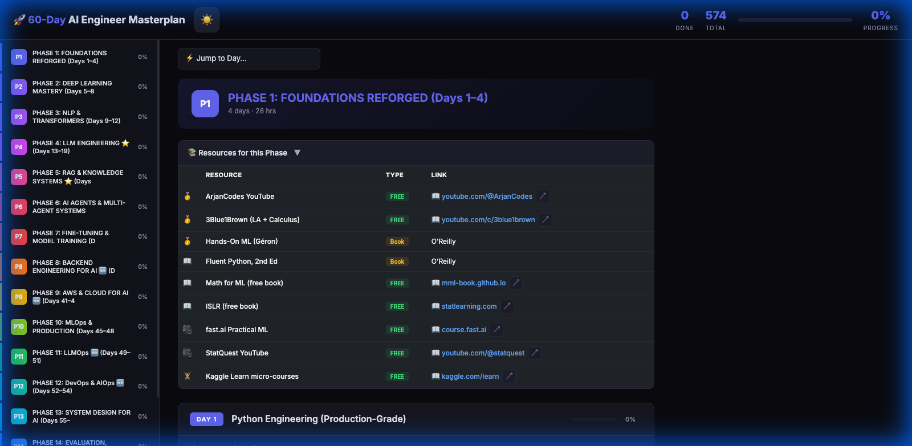
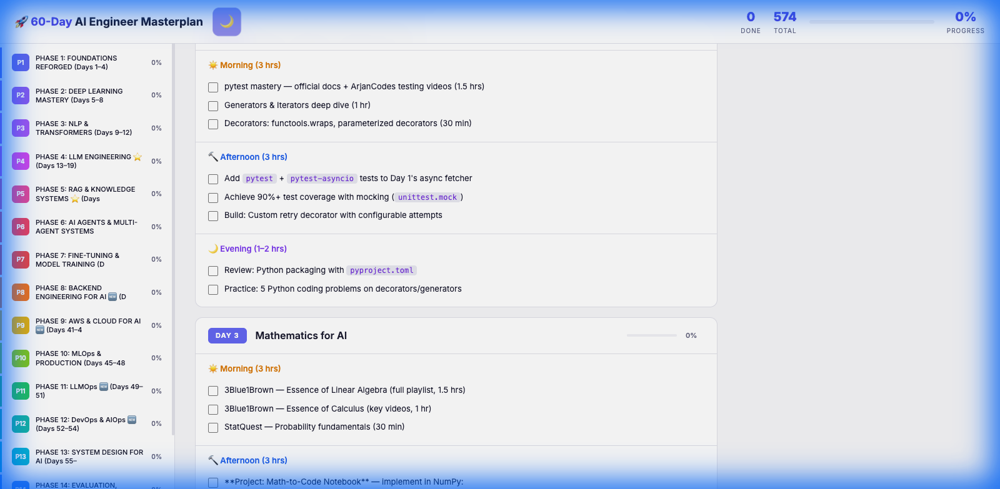
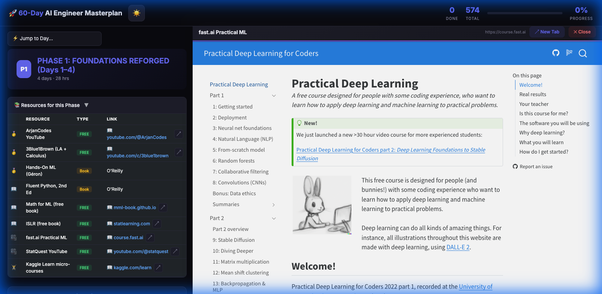

<p align="center">
  <h1 align="center">🚀 60-Day Senior AI Engineer Masterplan</h1>
  <p align="center">
    <strong>An interactive, self-paced study dashboard to go from 0 → Senior AI Engineer in 60 days.</strong>
  </p>
  <p align="center">
    <a href="https://peppy-zabaione-0883ab.netlify.app/">🌐 Live Dashboard</a> ·
    <a href="#features">✨ Features</a> ·
    <a href="#curriculum">📚 Curriculum</a> ·
    <a href="#screenshots">📸 Screenshots</a>
  </p>
  <p align="center">
    
    
    
    
    
  </p>
</p>

---

## 🎯 What is this?

A **static, zero-backend study dashboard** that tracks your progress through a comprehensive 60-day curriculum covering everything from Python fundamentals to LLM Engineering, RAG systems, AI Agents, MLOps, and System Design.

> **All progress is saved in your browser's `localStorage`** — no sign-up, no database, no tracking. Just open and start learning.

<p align="center">
  
</p>

---

## <a id="features"></a>✨ Features

| Feature | Description |
|---------|-------------|
| ✅ **574 Trackable Tasks** | Checkbox for every task — progress saved to `localStorage` |
| 📊 **Real-time Progress** | Per-day progress bars + global completion percentage |
| 📖 **98 Curated Resources** | Books, YouTube channels, free courses, tools — all linked |
| 🖥️ **Split-Pane Viewer** | Click any resource → opens inline in a **68/32 split view** |
| 🎬 **Smart YouTube Embed** | Videos/playlists auto-embed, channels show branded fallback |
| 🌙 **Dark / Light Mode** | Toggle with persisted preference |
| ⚡ **Quick Jump** | Dropdown to jump to any day instantly |
| 📱 **Responsive** | Works on desktop, tablet, and mobile |
| 🔄 **Resizable Panels** | Drag to resize the split-pane viewer |
| ⌨️ **Keyboard Shortcuts** | Press `Esc` to close the viewer |

---

## <a id="screenshots"></a>📸 Screenshots

### 🌑 Dark Mode (Default)


### ☀️ Light Mode


### 🖥️ Split-Pane Inline Viewer
Click any resource link → it opens directly inside the dashboard, no tab switching needed.



---

## <a id="curriculum"></a>📚 Curriculum Overview

| Phase | Days | Focus Area |
|-------|------|------------|
| **P1** | 1–4 | 🐍 Foundations Reforged (Python, Math, ML Basics) |
| **P2** | 5–8 | 🧠 Deep Learning Mastery (Neural Nets, PyTorch, CNNs) |
| **P3** | 9–12 | 📝 NLP & Transformers (Tokenization, BERT, GPT) |
| **P4** | 13–19 | ⭐ LLM Engineering (Prompting, LangChain, LangGraph) |
| **P5** | 20–26 | ⭐ RAG & Knowledge Systems (Vector DBs, CRAG, Agentic RAG) |
| **P6** | 27–31 | 🤖 AI Agents & Multi-Agent Systems (ReAct, MCP) |
| **P7** | 32–35 | 🔧 Fine-Tuning & Model Training (LoRA, RLHF, DPO) |
| **P8** | 36–40 | 🆕 Backend Engineering for AI (FastAPI, PostgreSQL, Redis) |
| **P9** | 41–44 | 🆕 AWS & Cloud for AI (Bedrock, SageMaker) |
| **P10** | 45–48 | ⚙️ MLOps & Production (Docker, CI/CD, Monitoring) |
| **P11** | 49–51 | 🆕 LLMOps (Prompt Mgmt, Eval Pipelines, Cost Tracking) |
| **P12** | 52–54 | 🆕 DevOps & AIOps (Kubernetes, IaC, Reliability) |
| **P13** | 55–57 | 🏗️ System Design for AI |
| **P14** | 58–59 | 🛡️ Evaluation, Safety & Governance |
| **P15** | 60 | 👑 Leadership & Capstone Planning |

### 🗓️ Daily Structure
Each day follows a structured **7–8 hour** study plan:

```
☀️ Morning  (3 hrs)  → Theory & Study (videos, docs, books)
🔨 Afternoon (3 hrs)  → Hands-On Coding (projects, implementations)
🌙 Evening  (1–2 hrs) → Review & Practice (notes, quizzes, problems)
```

---

## 🛠️ Tech Stack

| Tech | Purpose |
|------|---------|
| **HTML5** | Single-file static dashboard |
| **CSS3** | Custom properties for theming |
| **JavaScript** | Progress tracking, viewer, theme toggle |
| **Bootstrap 5** | UI components & responsive grid |
| **localStorage** | Zero-backend state persistence |
| **Python** | Generator script to build HTML from markdown |
| **Netlify** | Hosting & deployment |

---

## 🚀 Getting Started

### Option 1: Use the Live Dashboard
👉 **[Open Dashboard](https://peppy-zabaione-0883ab.netlify.app/)** — start checking off tasks immediately.

### Option 2: Run Locally
```bash
# Clone the repo
git clone https://github.com/kishor-kumar-nanda/ai_self_learn_60days_curriculum.git
cd ai_self_learn_60days_curriculum

# Just open the HTML file
open index.html
# or
python3 -m http.server 8080
# then visit http://localhost:8080
```

### Option 3: Regenerate from Markdown
```bash
# Edit the source masterplan markdown, then:
python3 generate_dashboard.py
# This regenerates the HTML from the markdown source
```

---

## 📁 Project Structure

```
ai_self_learn_60days_curriculum/
├── index.html                # The interactive dashboard (6000+ lines)
├── generate_dashboard.py     # Python script to regenerate HTML from markdown
├── screenshots/              # README screenshots
│   ├── dark_mode.png
│   ├── light_mode.png
│   └── split_pane.png
└── README.md                 # You are here
```

---

## 🔑 How Progress Works

```
Your Browser (localStorage)
    ├── ai-masterplan-progress  → { "cb-d1-t0": true, "cb-d1-t1": true, ... }
    └── ai-masterplan-theme     → "dark" | "light"
```

- ✅ **No account needed** — progress is stored in your browser
- 🔄 **Same browser = same progress** — your checkmarks persist across sessions
- ⚠️ **Different browser/device = fresh start** — localStorage is browser-specific
- 🧹 **Clearing browser data will reset progress**

---

## 🤝 Contributing

Found a broken link? Want to suggest a better resource? PRs welcome!

1. Fork the repo
2. Edit the source markdown or `generate_dashboard.py`
3. Regenerate: `python3 generate_dashboard.py`
4. Submit a PR

---

## 📄 License

This project is open-source and available under the [MIT License](LICENSE).

---

<p align="center">
  <strong>Built with ☕ and ambition to crack Senior AI Engineer interviews.</strong>
  <br/>
  <sub>Star ⭐ this repo if it helps your prep!</sub>
</p>
